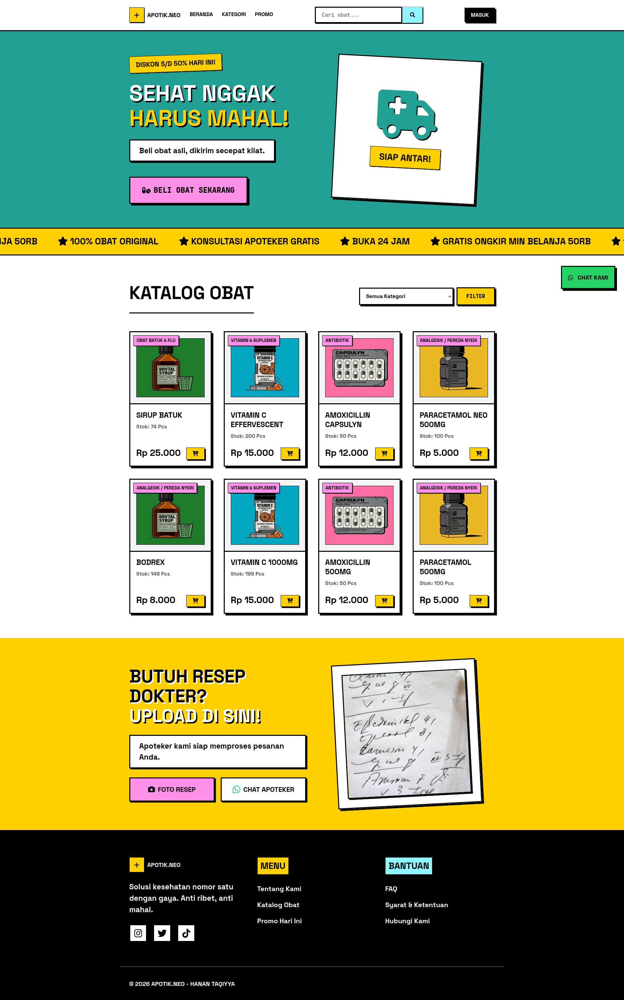
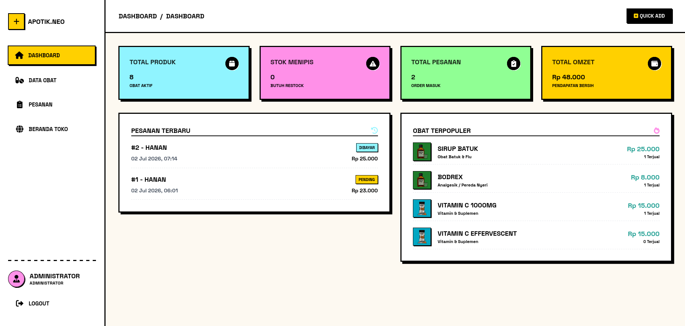
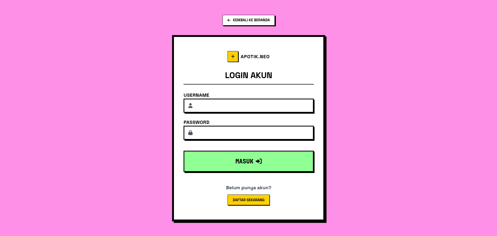

Asy-Syahid Abdurrahman Hanan Taqiyya 
NPM : 202343502436

# Aplikasi E-Commerce Apotek

Aplikasi berbasis web untuk sistem penjualan dan manajemen inventaris apotek (e-commerce). Sistem ini dirancang untuk memudahkan pelanggan dalam membeli obat-obatan secara online, serta memudahkan admin dalam mengelola stok obat dan pesanan.

## 📸 Screenshots

### 🖥️ Halaman Utama (Pelanggan)


### 📊 Dashboard Admin


### 🔑 Halaman Login


## 🚀 Fitur Utama

### Pengguna (User/Pelanggan)
- Registrasi dan Login akun
- Melihat katalog obat beserta kategorinya
- Menambahkan obat ke keranjang belanja
- Melakukan proses *checkout* dan pemesanan
- Melihat riwayat pesanan

### Admin
- Login sebagai admin
- **Dashboard Admin**: Melihat ringkasan total obat, stok menipis, total pesanan, dan pendapatan
- **Manajemen Obat**: Tambah, edit, dan hapus data obat
- **Manajemen Pesanan**: Melihat daftar pesanan pelanggan dan mengelola status pesanan

## 🛠️ Teknologi yang Digunakan
- **Frontend**: HTML5, CSS (Kustom / Vanilla CSS)
- **Backend**: PHP
- **Database**: MySQL

## 💻 Panduan Instalasi (Setup)

1. **Clone atau Download Repository**
   Pastikan folder proyek ini (misalnya `Apotik`) berada di dalam folder server lokal Anda, seperti:
   - XAMPP: `htdocs/Apotik`
   - Laragon: `www/Apotik`

2. **Setup Database**
   - Buka **phpMyAdmin** (biasanya di `http://localhost/phpmyadmin`).
   - Buat database baru, misalnya dengan nama `db_apotek` (disarankan sesuai dengan nama di file koneksi).
   - Import file `database.sql` yang telah disediakan ke dalam database tersebut.

3. **Konfigurasi Koneksi**
   Jika nama database Anda berbeda, Anda dapat mengubah konfigurasi koneksi pada file `config/koneksi.php` agar sesuai dengan pengaturan lokal Anda:
   ```php
   $host = "localhost";
   $user = "root";
   $pass = "";
   $db   = "db_apotek";
   ```

4. **Akses Aplikasi**
   Buka browser dan akses aplikasi melalui URL: `http://localhost/Apotik`

## 🔐 Akun Default Admin

Setelah mengimpor `database.sql`, Anda dapat menggunakan akun admin berikut untuk masuk ke dashboard admin:

- **Username**: `admin`
- **Password**: `admin123`

---
*Dibuat untuk keperluan tugas Pemrograman Web.*
